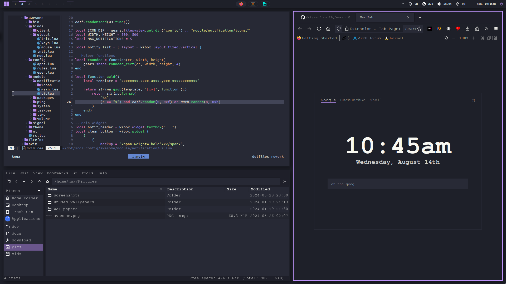

# ~/dot

 

<p align="center">
    
</p>

## Usage

Requires GNU [stow](https://www.gnu.org/software/stow).

```sh
make link # Set the symlinks
make unlink # Remove the symlinks
make relink # Reset the symlinks
make list # List the symlinks in a tree
```

## Software

Here is a brief list of the software I have configured. I'm running Arch on my desktop and Debian through WSL on my laptop.

- Alacritty
- AwesomeWM (git)
    - picom (default)
    - rofi
- Firefox
    - firenvim
    - tridactyl
    - [userChrome.css](https://github.com/Cyan903/Firefox-theme/releases)
- nvim & tmux
- bash & zsh

## License

[MIT](LICENSE)

